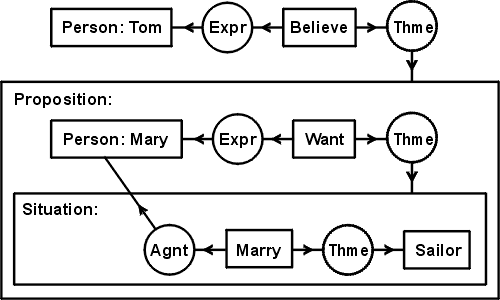

Sistemas de representación del conocimiento
-------------------------------------------
Pensamiento y Lenguaje están indisolublemente unidos, las estructuras conceptuales,
si bien son diferentes de las estructuras lingüísticas, mantienen con estas una
estrecha relación: para conocerlas, identificarlas y distinguirlas precisamos del
lenguaje natural, pero también para describirlas y representarlas. Sin embargo, el
aspecto lingüístico no es constitutivo de esas estructuras por más que sea su 
mediador (Izquierdo Arroyo, 1995 :cite:`IzquierdoArroyo1995`).

La bibliografía contemporánea recoge la problemática de las estructuras conceptuales
desde que en 1966 apareciera el libro de Shera sobre la "Documentación y la Organización
del Conocimiento" :cite:`Shera1966`; se trata de un problema que compete a las llamadas
Ciencias Cognitivas, que engloban disciplinas muy diferentes: la dimensión individual es
objeto de la Psicología, pero también hay una dimensión social que será objeto de la Sociología
y que se basa en el "principio de cooperación" :cite:`Grice1975` que establece que el discurso
es una actividad colaborativa que se rige por unas máximas aceptadas tácitamente por todos
cuantos participan en la conversación.

.. _teoria-dependencia-conceptual:

Teoría de la Dependencia Conceptual
```````````````````````````````````
La principal dificultad para desarrollar los sistemas de comprensión del discurso por
ordenador radica en proporcionarles esquemas conceptuales y conocimientos sobre el 
mundo que les permita realizar inferencias. Uno de los primeros esfuerzos en este sentido
lo encontramos en la obra de Roger C. Schank y Robert P. Abelson :cite:`Schank1977` donde
se proponen dar con un "aparato general para un intento de representar todo o cualquier
conocimiento", estudiando "cómo funciona la comprensión humana" puesto que "si entendemos
cómo comprende el ser humano, podremos saber cómo conseguir que un ordenador entienda,
y viceversa". Esta doctrina se apoya en la Teoría de la Dependencia Conceptual
:cite:`Schank1969` que es "una teoría de la representación del significado de las frases",
cuyo axioma básico consiste en que "para cualesquiera dos frases que son idénticas en
significado, sin tener en cuenta las diferencias en el lenguaje, existe una única
representación" [#]_.

.. [#] Las citas textuales han sido tomadas de :cite:`IzquierdoArroyo1995`.

Schank y Abelson estructuran el conocimiento en una secuencia de eventos,
guiones o *scripts* que representan a través de lo que llaman *primitivos léxicos*, que
pueden hacer referencia tanto a una acción (con la forma Actor-Acción-Objeto-Dirección-
(Instrumento)) como a un estado (Objeto-(está en)-Estado-(con Valor)). Los autores
identifican 11 actos primitivos que son los constituyentes esenciales de cualquier acción
más compleja, con lo que las reglas de inferencia y razonamiento deben definirse sobre
un conjunto finito y reducido de elementos. A partir de los guiones almacenados en la
memoria, el ser humano y el ordenador pueden elaborar razonamientos y responder a las
consultas o peticiones de información.


.. _grafos-conceptuales:

Grafos conceptuales
```````````````````
La característica fundamental que debe tener una interlingua es su capacidad para 
representar cualquier tipo de conocimiento de una forma no ambigua. Una de las
herramientas más potentes para la representación del conocimiento que además
permite realizar inferencias son los grafos conceptuales (CG, *Conceptual Graph*),
éstos son introducidos por Sowa en 1976 :cite:`Sowa1976` donde los define como:

    A *conceptual graph* is a finite, connected, undirected, bipartite graph with
    nodes of one type called *concepts* and nodes of the other type called
    *conceptual relations*. A conceptual graph may consist of a single concept,
    but it cannot have conceptual relations with unattached links. [#]_
    (Cursivas en el original)

.. [#] Traducción: Un *grafo conceptual* es un grafo bipartito finito, conectado y no
   dirigido en el que los nodos de un tipo se llaman *conceptos* y los del otro tipo se
   conocen como *relaciones conceptuales*. Un grafo conceptual puede constar de un único
   concepto, pero no puede contener relaciones conceptuales que tengan enlaces sin conectar.

La primera aproximación de Sowa a los grafos conceptuales la realiza en el contexto
de las bases de datos y los sistemas de recuperación de información [#]_, como una herramienta
intermedia de comunicación entre los usuarios y las máquinas: el grafo describe el 
significado desde el punto de vista del humano, pero su codificación puede ser fácilmente
interpretada por un programa:

 * Los **conceptos** están representados por cajas que contienen un etiqueta identificativa
   del elemento cognitivo que representan, que puede tratarse de cualquier entidad real o 
   abstracción. Sowa, además, introduce una propiedad de ordenamiento entre los conceptos
   que le permite crear una estructura jerárquica; esta propiedad, representada por ''<'',
   puede aplicarse a dos conceptos cualesquiera :math:`a` y :math:`b`, de tal forma que
   si se cumple :math:`a < b` entonces :math:`a` es un *subtipo* de :math:`b`, es decir,
   representa un concepto más específico. No hay ninguna restricción que impida que un
   concepto sea *subtipo común* de varios otros, por lo que la jerarquía que puede
   construirse de este modo será un grafo acíclico dirigido (DAG, *Directed Acyclic Graph*).   

 * Las **relaciones conceptuales** están representadas por círculos en el grafo y pueden tener una
   o más conexiones. Estas relaciones actúan como restricciones al seleccionar qué conceptos
   pueden unir :cite:`Clancey1985`, de esta forma incorporan una dimensión lógica en los grafos.

 * En Sowa (2003) :cite:`Sowa2003` el autor introduce los *nested graph models* (NGM) que
   permiten expresar el **contexto** de una relación, así es posible incorporar lógica modal y
   temporal.

.. [#] John F. Sowa desarrolla los CGs en más profundidad en sus libros
   *Conceptual Structures: Information Processing in Mind and Machine*, Addison Wesley
   Publishing Co., London, UK, 1984 y *Knowledge Representation: Logical, Philosophical and
   Computational Foundations*, Brooks Cole Publishing Co., Pacific Grove, CA, 2000.

Sowa habla de ontologías en relación a los nodos-concepto, indica que la selección de las
categorías ontológicas debe ser el primer paso para diseñar una base de datos, de
conocimiento o un sistema orientado a objetos :cite:`Shapiro2012`; sin embargo no
introduce ningún tipo de restricción en cuanto a los tipos de relaciones existentes que
pueden aparecer en el grafo.



   Un grafo conceptual con dos contextos anidados. El grafo representa la oración *Tom believes that Mary wants to marry a sailor*. Imagen extraída de Sowa (2003) :cite:`Sowa2003`.
   

Semántica estructural
`````````````````````
En los nodos de tipo *concepto* de los CGs tiene que tener cabida cualquier entidad real
o abstracta y ésta tiene que poder expresarse de una manera no ambigua. En su artículo de
1976 :cite:`Sowa1976` Sowa ya indica que estos conceptos son meros identificadores y que
por conveniencia son representados con una breve etiqueta en inglés, pero podría tratarse
de un número o una dirección de memoria en un ordenador.

Más importante es la jerarquización entre conceptos que introduce a través de la propiedad
''<'' a la que hemos hecho mención, en artículos posteriores Sowa empezará a hablar de
ontología y de categorías al hace referencia a la jerarquía de conceptos.

El término *ontología* hace referencia a una parte de la metafísica que trata del ser en
general y sus propiedades trascendentales; es un concepto que se ha estudiado desde época
clásica, con la intención de realizar una clasificación de todo lo que *es*.
Sin embargo, nos interesa más abordar las ontologías desde el punto de vista de la
Ingeniería del Conocimiento, en este ámbito
una de las definiciones más extendidas y aceptadas es la que se ofrece en :cite:`Studer1998`:
*"An ontology is a formal, explicit specification of a shared conceptualization"* [#]_. Por
*conceptualización* se entiende una modelización abstracta de un fenómeno identificando sus
conceptos relevantes. Por *explícito* se hace referencia a que tanto los conceptos como sus
relaciones y restricciones tienen que estar definidas explícitamente. Al ser *formal* la
ontología puede procesarse mediante un programa informático (no estará expresada en lenguaje
natural). Y también tiene que ser *compartida*, tiene que recoger un conocimiento consensuado,
ha de ser aceptada por un grupo.

.. [#] Traducción: una ontología es una especificación explícita y formal de un
   conceptualización compartida.

En los sistemas de traducción automática una ontología de los conceptos deberá recoger toda
la realidad expresable en cualquier lenguaje natural, todos los significados posibles a los
que haga referencia cualquier significante, ya sean realidades o pensamientos, abstracciones
o acciones.

.. Nos adentramos en terrenos de semiótica, y cosas superinteresantes de estructuralismo y demás, hablamos de Saussure, Hjelmslev, Wittgenstein... si tuviéramos tiempo nos adentraríamos más por este camino para bordar este capítulo y ponerle un título meritorio.

El estudio de los conceptos, los referentes, los símbolos, etc. es una rama de la lingüística que 
se desarrolla como ciencia durante el siglo XX y de forma sistemática a partir de los 1960s.
La semiótica comienza su andadura con lingüísticas y filólogos como Ferdinand de Saussure,
Louis Hjelmslev, Roman Jakobson y Ludwig Wittgenstein en Europa y paralelamente en
Estados Unidos con Charles Sanders Peirce. Peirce y Saussure son contemporáneos y abordan el
mismo problema, la creación de una *ciencia de los signos*, pero desde perspectivas diferentes.
Saussure, lingüista, la aborda desde una perspectiva psicosocial e indica que se trata de una
nueva ciencia a la que llama *semiología*, Peirce considera que esta
ciencia de los signos ya existe desde la antigüedad, aunque no plenamente desarrollada
:cite:`Castanares2000`, así su trabajo consistió en la exploración, sistematización y ampliación
de la lógica heredada de Aristóteles :cite:`Peirce1902`. Peirce desarrolló los grafos
existenciales, que son el punto de partida para los grafos conceptuales de John F. Sowa.

Fruto de estos estudios en el campo de la lingüística se realizan avances muy importantes
relacionados con el significado de las palabras, nos interesa aquí hacer referencia a la
semántica estructural y las principales relaciones que se dan entre significados y que
han de ser considerados en una ontología de conceptos :cite:`WPSemantica`:

 * **Hiperonimia**: es la relación que se da entre una palabra (hiperónimo) cuyo significado
   está totalmente incluido en los significados de otras más específicas (hipónimos).
 * **Hiponimia**: es la relación en la que el significado de una palabra más específica
   (hipónimo) contiene todos los rasgos de significado del término más general (hiperónimo).
   Dos hipónimos de un mismo hiperónimo, son cohipónimos.
 * **Holonimia**: es la relación que se establece entre una palabra (holónimo) y otra u
   otras (merónimos) que designan partes de lo denotado por la primera. No se trata de una
   relación entre significados, sino de rasgos extralingüísticos.
 * **Meronimia**: un merónimo designa una parte de la realidad nombrada por un holónimo.

Atendiendo a las propias palabras en relación con sus significados encontramos los siguientes
fenómenos :cite:`WPSemantica`:

 * **Monosemia**: palabras que tienen un único significado o acepción.
 * **Polisemia**: una sóla palabra tiene varios significados, estando todos ellos emparentados
   semánticamente.
 * **Homonimia**: varios significados asociados a una misma forma, pero con orígenes diferentes.
 * **Sinonimia**: es la relación entre dos términos de significados similares e intercambiables
   en el discurso por pertenecer a la misma categoría sintáctica.
 * **Antonimia**: es la relación que mantienen dos palabras cuyos significados se oponen.

En la :num:`figura #fig-wordnet-lightning` se muestran algunos casos de hiperonimia/hiponimia y
holonimia/meronimia en torno a la palabra *candle*. En la misma imagen se puede ver también el
fenómeno polisémico de esta palabra en inglés que puede denotar los conceptos de *vela*, *candela*
o hacer referencia al verbo, inexistente en español, para referirse a la realización de una
ovoscopia.


.. _fig-wordnet-lightning:
.. graphviz::
   :caption: Esquema de relaciones semánticas en torno a la palabra *candle*, que en inglés hace referencia a los conceptos *vela* y *candela*, y también al verbo utilizado para la realización de una *ovoscopia*. Cada nodo representa un concepto (representado por varias palabras sinónimas). Las relaciones han sido extraídas de Wordnet v3.1.

   digraph foo {
        
        wick2[label="(n) wick#2\n<es:mecha>"]
        candle1[label="(n) candle#1\n<es:vela>"]
        candlewick1[label="(n) candlewick#1\n<es:pabilo>"]
        lamp1[label="(n) lamp#1\n<es:lámpara>"]
        lantern1[label="(n) lantern#1\n<es:linterna>"]
        sourceofillumination1[label="(n) source of illumination#1\n<es:fuente de iluminación>"]
        dots1[label="..."]
        dip7[label="(n) dip#7"]
        vigillight1[label="(n) vigil light#1"]

        candle2[label="(n) candle#2\n<es:candela>"]
        luminousintensityunit1[label="(n) luminous intensity unit#1\n<es:unidad de intensidad lumínica>"]
        lightunit1[label="(n) light unit#1"]
        dots2[label="..."]

        entity[label="(n) entity#1\n<es:entidad>"]

        candle1v[label="(v) candle#1"]
        examine2v[label="(v) examine#2\n<es:examinar>"]

        # Hiperónimos
        wick2 -> candlewick1 [label="hyponym"]
        lamp1 -> candle1 [label="hyponym"]
        lamp1 -> lantern1 [label="hyponym"]
        sourceofillumination1 -> lamp1 [label="hyponym"]
        dots1 -> sourceofillumination1 [label="hyponym"]
        candle1 -> dip7 [label="hyponym"]
        candle1 -> vigillight1 [label="hyponym"]

        # Holónimos
        {rank=same; candlewick1 candle1}
        candlewick1 -> candle1 [style=dotted, label="meronym"]
        wick2 -> candle1 [style=dotted, label="meronym"]

        # Otra rama para candle
        dots2 -> lightunit1 -> luminousintensityunit1 -> candle2 [label="hyponym"]

        entity -> dots1 [label="hyponym"]
        entity -> dots2 [label="hyponym"]

        # Y otra más
        examine2v -> candle1v [label="hyponym"]
   }


.. _wordnet:
WordNet
```````
Una de los esfuerzos más importantes para realizar una ontología de conceptos es WordNet
:cite:`Miller1990` :cite:`Fellbaum1998`, se trata de una red de conceptos que contiene
información codificada manualmente sobre sustantivos, verbos, adjetivos y adverbios
en inglés; los términos que representan un mismo concepto están agrupados en *synsets* y 
son estos elementos los que constituyen los nodos de la red.
WordNet se creó en el Laboratorio de Ciencia Cognitiva de la Universidad de Princeton en
1985 bajo la dirección del profesor de psicología George Armitage Miller (1920-2012).

Un *synset* es un conjunto de palabras de la misma categoría gramatical que hacen
referencia al mismo concepto, por lo tanto pueden ser intercambiadas en un texto sin
afectar al significado. Son elementos semánticamente equivalentes. Las palabras
polisémicas aparecerán múltiples veces en *synset* diferentes.
WordNet se encuentra actualmente en su versión 3.1 y se puede acceder online en 
``https://wordnet.princeton.edu``, cuenta con más de 117.000 synsets.

.. TODO: Hablar de que los sinónimos tienen matices, 

Las principales relaciones codificadas en WordNet son las de hiperonimia/hiponimia, seguidas
por las de holonimia/meronimia, ambas estructuran los conceptos en jerarquías como la que
se muestra en la :num:`figura #fig-wordnet-lightning`. Los verbos también están organizados
en jerarquías arbóreas donde los hijos expresan maneras cada vez más específicas de realizar
la acción (troponimia). Los adjetivos incluyen relaciones de antonimia, similaridad
semántica y también relaciones con los sustantivos de los cuales derivan. En cuanto a los
adverbios, son la categoría gramatical menos representada, en general están relacionados
con los adjetivos de los que derivan.

WordNet es un recurso valiosísimo para cualquier tipo de aplicación con contenido semántico,
como lo es una interlingua para representación del conocimiento; así WordNet se puede utilizar
como un diccionario para identificar sin ambigüedades los conceptos que se utilizan en los
nodos de un grafo conceptual y también, como veremos posteriormente, es una herramienta ideal
para medir distancias semánticas entre conceptos.


EuroWordNet
```````````
La importancia probada de WordNet en la investigación asociada a lingüística computacional
condujo a la creación de un proyecto europeo (LE-2 4003 y LE-4 8328) para generar *wordnets*
en otros idiomas europeos y unir todos ellos en una base de datos multilingüe que permite,
a partir de una palabra, consultar palabras similares en cualquier otro idioma [#]_.

.. [#] EuroWordNet: Building a multilingual database with wordnets for several European
   languages. http://www.illc.uva.nl/EuroWordNet/ (accedida en mayo de 2015) 

Los primeros cuatro idiomas que se adhirieron al proyecto fueron holandés (Universidad de
Amsterdam), italiano (CNR, Pisa), español (Fundación Universidad Empresa) e inglés (Universidad
de Sheffield, adaptando el WordNet original); posteriormente se incorporan el checo, estonio,
alemán y francés :cite:`Vossen1998`.

La principal contribución de este proyecto es la multilingualidad, el *wordnet* de cada idioma
es específico, pero todos ellos se integran en una base de datos única a través de un índice
interlingual (ILI, *inter-lingual index*) que conecta los *synsets* que son equivalentes
en los diferentes idiomas.

El proyecto se dió por finalizado en 1999 con la definición de la base de datos, las relaciones,
la *Top Concept Ontology* (una ontología con 63 conceptos abstractos que se utilizaría para
clasificar al resto de conceptos más concretos) y la definición del índice ILI. Con
posterioridad se han seguido desarrollando los *wordnets* de cada idioma y se han sumado
idiomas nuevos que han utilizado las especificaciones del EuroWordNet para generar sus bases
de datos.

Actualmente el testigo ha sido recogido por la *Global WordNet Association* [#]_ que intenta
promover el desarrollo, difusión y estandarización de los *wordnets* que se vayan realizando.

.. [#] The Global WordNet Association. http://globalwordnet.org/ (accedido en mayo de 2015).

Apoyándose en estas redes de conceptos se han desarrollado multitud de aplicaciones
de procesamiento de lenguaje natural, y recursos lingüísticos como el proyecto *MEANING
Multilingual Central Repository* :cite:`Atserias2004`, ontologías como SUMO :cite:`Niles2001`
o la *EuroWordNet Top Concept Ontology* que ya hemos citado :cite:`Alvez2008`.


Interlingua
```````````
En el capítulo introductorio hablamos de la traducción automática utilizando sistemas basados
en interlinguas (ver :ref:`sección 1.3 <traduccion-interlingua>`) como la aproximación
adecuada en un entorno multilingüe, sin embargo existen algunos problemas que dificultan
su utilización.

El argumento más relevante en contra del uso de las interlinguas está relacionado con el nivel
de abstracción y universalidad que debe tener esta lengua, lo que la convertiría en inviable
económicamente :cite:`Martins2002`: no sólo debería ser capaz de expresar cualquier significado
de cualquier lengua sino que también tendría que poder trabajar con las particularidades
cognitivas de todas las culturas, un problema sin acotar. Por ejemplo, una interlingua de
carácter universal debería ser capaz de representar la lógica trivalente del
aymara :cite:`Rojas1985`, que supone un desafío para el mundo occidental heredero de la
lógica dicotómica aristotélica.
Hutchins :cite:`Hutchins1992` expone otros muchos problemas acompañados de una gran
colección de ejemplos.

.. TODO: Citas sobre ULTRA, KANT y PIVOT en http://www.unl.fi.upm.es/consorcio/archivos/publicaciones/lrec/lrec-martins.pdf

Eurotra
+++++++
Ante la dificultad (en la práctica insalvable) que supone construir una interlingua universal,
se proponen interlinguas restringidas que permitan una representación exacta para un 
conjunto cerrado de lenguas.
Un ejemplo de este tipo ha sido el proyecto Eurotra que se concibe en 1978 y se dota de fondos
en noviembre de 1982 con el objetivo de producir traducciones
satisfactorias para todos los idiomas de la Comunidad Europea :cite:`Hutchins1992a`.
Es un proyecto a medio camino entre una interlingua y los
sistemas *transfer* entre pares de lenguas.

El proyecto se detiene en 1992 sin que lograra desembocar en un sistema comercial de traducción
automática, sin embargo sí que llegó a crear un prototipo de investigación y sentó las
bases para el nacimiento de grupos de investigación asociados con la traducción en los
países del sur del continente europeo.

PIVOT
+++++

.. La información está sacada de aquí: http://www.tendencias21.net/iartificial/m/Haciendo-memoria_a17.html

A finales de los 1980s también se iniciaba el proyecto de traducción automática multilingüe
conocido como PIVOT; a diferencia del programa EUROTRA, éste sí planteaba la creación de una
interlingua que sirviera como eje de las traducciones.
No era el único proyecto en este sentido, Fujitsu lo estaba haciendo en su proyecto ATLAS
(Dr. Uchida) y la universidad Carnegie Mellon de Pittsburg (USA) con KANT (Jaime Carbonell).

PIVOT estaba dirigido por el Dr. Muraki desde Japón y patrocinado por NEC. En España, la
Universidad Politécnica de Madrid se encargó de desarrollar el módulo de español cuyo
objetivo era convertir los textos de español en la interlingua y generar las traducciones
a español.

Este proyecto también finaliza en 1992, al igual que EUROTRA. El proyecto ATLAS, por su
parte, aún puede ser encontrado en la página web de Fujitsu como un producto comercial
relacionado con la traducción, aunque sólo entre el par de lenguas inglés-japonés [#]_.

.. [#] Fujitsu. ATLAS V14. Información disponible en https://www.fujitsu.com/global/products/software/packaged-software/translation/atlas/ (accedido en junio de 2015)


El lenguaje universal UNL
`````````````````````````
Un paso adelante en las interlinguas para representación del conocimiento es el lenguaje
universal (UNL, *Universal Networking Language*). Este *lenguaje* surgió como una
iniciativa del Instituto de Estudios Avanzados de la Universidad de la Naciones Unidas
en 1996 con el objetivo de eliminar las barreras lingüísticas para el comercio y la
educación.

La representación de un texto en UNL se realiza oración por oración, cada oración se
codifica en un hipergrafo donde los conceptos son los nodos y las relaciones entre ellos
constituyen los arcos. Este hipergrafo también puede ser representado como un conjunto
de relaciones binarias que enlazan los conceptos presentes en la oración.

Los conceptos se representan con etiquetas literales que reciben el nombre de
*palabras universales* (UW, *Universal Words*) que además pueden ir acompañadas de
varios attributos (se utiliza el símbolo ''@'' para indicarlos) que
permiten mostrar más informacón sobre el uso específico del concepto en la oración
original :cite:`Uchida1999`. Estas UWs son el equivalente a los nodos-concepto de Sowa
y a los *synsets* de WordNet.

Como ejemplo, mostramos el utilizado por Uchida y Zhu en :cite:`Uchida2001` donde muestran
la codificación de la oración "Hace tiempo, en la ciudad de Babilonia, la gente comenzó a
construir una torre enorme, que parecía alcanzar los cielos." tanto en su forma
gráfica (:num:`figura #fig-example-unl`) como codificada (:num:`listado #code-example-unl`).


.. _fig-example-unl:
.. graphviz::
   :caption: Representación gráfica en UNL de la oración "Hace tiempo, en la ciudad de Babilonia, la gente comenzó a construir una torre enorme, que parecía alcanzar los cielos.". El atributo ''@entry'' indica el concepto principal de la oración.

   digraph foo {
        rankdir=TB
        
        begun[label="begin(icl>do).@entry.@past"]
        long_ago[label="long ago(icl>ago)"]
        city[label="city(icl>region).@def"]
        Babylon[label="Babylon(iof>city)"]
        people[label="people(icl>person).@def"]
        build[label="build(icl>do)"]
        tower[label="tower(icl>building).@indef"]
        huge[label="huge(icl>big)"]
        seemed[label="seem(icl>be).@past"]
        reach[label="reach(icl>come).@begin.@soon"]
        heaven[label="heaven(icl>region).@def.@pl"]

        begun -> build [label="obj"]
        build -> tower [label="obj"]
        begun -> people [label="agt"]
        begun -> long_ago [label="tim"]
        begun -> city [label="plc"]
        city -> Babylon [label="mod"]
        build -> people [label="agt"]
        tower -> huge [label="aoj"]
        reach -> tower [label="obj"]
        seemed -> tower [label="aoj"]
        reach -> seemed [label="obj", dir=back]
        reach -> heaven [label="gol"]

        {rank=same; begun build tower}
        }


.. code-block:: unl
   :caption: Codificación en UNL de la oración "Hace tiempo, en la ciudad de Babilonia, la gente comenzó a construir una torre enorme, que parecía alcanzar los cielos.".
   :name: code-example-unl
   
    [S:2]
    {org:es}
    Hace tiempo, en la ciudad de Babilonia, la gente comenzó
    a construir una torre enorme, que parecía alcanzar los
    cielos.
    {/org}
    {unl}
    tim(begin(icl>do).@entry.@past, long ago(icl>ago))
    mod(city(icl>region).@def, Babylon(iof>city))
    plc(begin(icl>do).@entry.@past, city (icl>region).@def)
    agt(begin(icl>do).@entry.@past, people(icl>person).@def)
    obj(begin(icl>do).@entry.@past, build(icl>do))
    agt(build(icl>do), people.@def)
    obj(build(icl>do), tower(icl>building).@indef)
    aoj(huge(icl>big), tower(icl>building).@indef)
    aoj(seem(icl>be).@past, tower(icl>building).@indef)
    obj(seem(icl>be).@past, reach(icl>come).@begin.@soon)
    obj(reach(icl>come).@begin-soon,
        tower(icl>building).@indef)
    gol(reach(icl>come).@begin-soon, 
        heaven(icl>region).@def.@pl)
    {/unl}
    [/S]


En el ejemplo indicado aparecen numerosas relaciones como ``mod``, ``agt``, ``aoj``, etc.
que indican la relación entre los conceptos (UWs) que enlazan, aparecen varias UWs como
``city(icl>region)``, ``tower(icl>building)`` que indican objetos o ``seem(icl>be)``, 
``begin(icl>do)`` que son verbos, e incluso adjetivos como ``huge(icl>big)`` o el adverbio
``long ago(icl>ago)``; también aparece una UW que es un nombre propio de ciudad
``Babylon(iof>city)``. Muchas UWs están acompañadas por varios attributos como ``@past``,
``@def`` o ``@entry``.
Las palabras universales UWs y las relaciones están diseñadas para representar el contenido
objetivo del texto (el mensaje, la información, el contenido semántico), mientras que los
atributos codifican rasgos gramaticales del lenguaje, intencionalidad, etc. que pueden
no ser representables en todas las lenguas.

La principal diferencia entre el UNL y otros sistemas de representación del conocimiento como
los grafos conceptuales (ver :num:`sección #grafos-conceptuales`) o el *Resource Description
Framework* (RDF) :cite:`Brickley2014` es que el número y el significado de las relaciones y
attributos deben formar parte del estándar :cite:`TeixeiraMartins2005`.


Antes de continuar con la exposición del lenguaje UNL debe hacerse notar que actualmente todo
el consorcio UNL no comparte las mismas especificaciones y los grupos originales de trabajo
están divergiendo en sus líneas de investigación y estándares. La Comunidad Europea ha dejado
de financiar el proyecto y no ha vuelto a mostrar interés por él :cite:`Tovar2000` y es la
Fundación UNDL quien se encarga de coordinar los diferentes Centros de Lengua siendo éstos
ahora los que tienen que buscar financiación para mantener la iniciativa.

Asimismo la inactividad de la Fundación UNDL desembocó en la creación del
Consorcio UNL [#]_ en 2005 en el marco de la conferencia CICLING (Méjico); en 2006 este
consorcio adoptó el nombre Consorcio U++ [#]_.

.. [#] El acuerdo de constitución del Consorcio UNL puede ser consultado en http://www.unl.fi.upm.es/consorcio/archivos/term_constitution.pdf (accedido en junio de 2015).

.. [#] Datos históricos extraídos de la web del Consorcio U++. http://www.unl.fi.upm.es/consorcio/index.php (accedido en junio de 2015).

.. TODO: En las notas aparece un U3+, pero no lo encuentro por ninguna parte.


La última especificación del lenguaje realizada por la UNDL Fundation (aunque no es aceptada
por parte del Consorcio U++) es la Version II (16 de febrero de 2014) :cite:`Zhu2014` que
incluye 57 relaciones y 94 atributos. 
Las UWs no son un conjunto cerrado, cualquier persona puede proponer nuevas UWs que expresen
un concepto no contemplado hasta el momento, aunque en teoría existe [#]_ una base de datos,
*UNL Knowledge Base* u Ontología UNL, con todas las UWs aceptadas y sus
relaciones :cite:`Zhu2002`.

.. [#] A pesar de que se habla de la *UNL Knowledge Base* o más recientemente Ontología UNL en
   varios entradas bibliográficas, el autor no ha sido capaz de encontrar esta base de datos ni
   de obtener una referencia cierta a la misma.


Palabras universales (UWs)
++++++++++++++++++++++++++

Las UWs constituyen una red de palabras similar a la vista en WordNet (:num:`sección #wordnet`),
UNL tiene las mismas cuatro categorías de conceptos: sustantivos, verbos, adjetivos y adverbios.
Las UWs se forman utilizando una palabra inglesa como etiqueta seguida de un conjunto de 
restricciones:

.. math::

    <UW> ::= <headword> [<constraint \quad list>]

donde cada una de las partes es:

 * La *headword* es una expresión en inglés (usualmente es una palabra, pero puede ser una
   palabra compuesta o una oración si es necesario) que representa un conjunto de términos
   a los que hace referencia esa expresión en inglés, se conoce como *Basic UW*. Si no
   existe una etiqueta en inglés para hacer referencia al concepto, entonces se utiliza la
   palabra correspondiente en otro idioma y la UW se conoce como *Extra UW*.
 * La lista de restricciones sirve para desambiguar los distintos significados a los que puede
   hacer referencia una misma *headword*. Cada restricción está formada por una relación UNL
   y otra UW previamente definida que se combina con esta UW en dicha relación. Estas UWs
   desambiguadas se conocen como *Restricted UW*. 

La :num:`tabla #table-uws-example` muestra algunos ejemplos de UWs con los significados
correspondientes; aparecen algunas UWs básicas como *go* o *house*, UWs restringidas y 
también ejemplos de UWs extra.

.. tabularcolumns:: |p{0.2\linewidth}|p{0.2\linewidth}|p{0.2\linewidth}|p{0.25\linewidth}|
.. list-table:: Ejemplos de UWs.
   :name: table-uws-example
   :header-rows: 1

   * - **UW**
     - **Headword**
     - **Restricciones**
     - **Significado**
   * - go
     - go
     -
     - Ir
   * - house
     - house
     -
     - Casa
   * - state(icl>country)
     - state
     - icl>country
     - País
   * - state(icl>region)
     - state
     - icl>region
     - Región de un país
   * - state( icl>express( agt>thing, gol>person, obj>thing))
     - state
     - icl>express( agt>thing, gol>person, obj>thing)
     - Acción por la que una persona expresa algo
   * - samba(icl>dance)
     - samba
     - icl>dance
     - Danza popular brasileña.
   * - soufflé(icl>food)
     - soufflé
     - icl>food
     - Tipo de comida

Todas las UWs aceptadas deberían estar recogidas en un único repositorio centralizado conocido
como *UNL Ontology* (anteriormente *UNL Knowledge Base*). Esta base de datos constituiría una red
semántica con todas las relaciones binarias dirigidas que existen entre las palabras universales,  asignando a éstas relaciones un grado de certeza absoluto (imposible o verdadero) [#]_.
De esta forma cualquier UW aceptada aparecería en la ontología relacionada con otras palabras.

.. [#] La posibilidad de asignar a una relación un grado de certeza *imposible* sirve para
   eliminar relaciones heredadas. Por ejemplo, si una palabra permite una relación determinada
   todos sus hipónimos también la permitirán por haberla heredado; la única manera de eliminarlas
   es utilizar estas declaraciones de imposibles.

Las relaciones principales entre UWs para construir la ontología son las siguientes:

 * ``icl`` (incluido en, tipo de): indica un concepto superior o más general, codifica la
   relación de hiponimia descrita en apartados anteriores.
 * ``equ`` (equivalencia): indica equivalencia entre dos conceptos, se puede asimilar a
   una relación de sinonimia.
 * ``iof`` (instancia de): indica el tipo de concepto al que pertenece la instancia, se
   utiliza con entidades y nombres propios.
 * ``pof`` (parte de): codifica la relación de meronimia.

La Ontología UNL también contendría el resto de relaciones posibles entre cualquier par de
UWs, no obstante, estas relaciones sólo aparecerían entre los conceptos más generales posibles,
de tal forma que se explota la propiedad de herencia de las UWs: cualquier UWs hereda las
relaciones más restrictivas de sus hiperónimos.

Esta ontología constituiría una red semántica con características similares a WordNet, por lo
que las técnicas y metodologías utilizadas sobre WordNet podrán ser aplicadas al sistema UNL
sin requerir una adaptación especial. En concreto en el problema de distancia entre grafos
conceptuales, la distancia entre los conceptos podrá ser medida utilizando las relaciones
presentes en esta ontología.
De hecho existen algunos esfuerzos que muestran cómo se puede utilizar WordNet para enriquecer
un diccionario UNL, mapeando los conceptos UNL con los *synsets* de la jerarquía de
WordNet :cite:`Iraola2003`.

