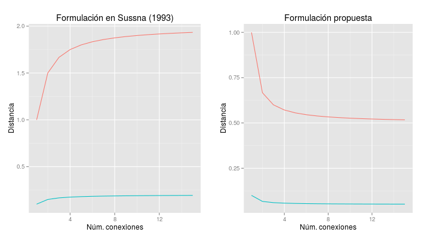

Recursos utilizados
===================
El modelo propuesto se apoya en varios recursos, algoritmos y librerías desarrollados por
otras personas, nosotros las combinamos y añadimos nuestra aportación para poder
calcular la medida que nos interesa.

El autor ha podido utilizar algunos de los recursos tal cual estaban disponibles, pero en otros
ha colaborado en su desarrollo o transcripción al lenguaje de programación seleccionado, se
indicará en cada caso las contribuciones realizadas.

WordNet 3.1
-----------
En la exposición del estado del arte hemos descrito sucintamente la base de datos WordNet y
sus características (ver :num:`sección #wordnet`), no lo repetiremos aquí. Para este
trabajo hemos utilizado el diccionario correspondiente a la versión 3.1.

SemCor
------
El corpus SemCor es el único recurso etiquetado con WordNet que hemos encontrado; su 
utilización es imprescindible para poder hacer uso de medidas de distancia que tienen
en cuenta el contenido de información
(ver :num:`sección #redes-conceptos-contenido-informacion`). Sin embargo no hemos
considerado cómo de representativo es este corpus para los el dominio de información
en el que vamos a experimentar, los resultados de algunas medidas de distancia pueden
verse profundamente afectados por esta circunstancia.

WordNet-blast
-------------
WordNet-blast es un proyecto de código abierto desarrollado por Ugo Jardonnet que pretende
proveer un acceso rápido a la ontología WordNet [#]_. El código fuente está disponible en
Github [#]_, nosotros hemos tenido que realizar algunas modificaciones sobre el mismo para
subsanar algún error y prepararlo para su utilización desde nuestro modelo [#]_.

.. [#] Página personal de Ugo Jardonnet: http://logserv.free.fr/ (accedida en junio de 2015)

.. [#] Github. Código fuente de Wordnet-blast. https://github.com/jardon-u/wordnet-blast

.. [#] Algunas de estas modificaciones han sido incorporadas al código fuente del repositorio
   principal, otras están disponibles en la rama perteneciente al autor de esta
   tesis: https://github.com/jgsogo/wordnet-blast

Medidas de distancia entre conceptos
------------------------------------
En el estado del arte hemos visto varios intentos por diferentes autores para lograr una
medida de distancia (similaridad en algunos casos) entre conceptos utilizando la jerarquía de
WordNet. Nosotros hemos implementado las siguientes utilizando el lenguaje C++:

 * Jiang y Conrath (1997) :cite:`Jiang1997`.
 * Leacock y Chodorow (1998) :cite:`Leacock1998`.
 * Lin (1998) :cite:`Lin1998`.
 * Resnik (1995) :cite:`Resnik1995`.
 
 * Sussna (1993) :cite:`Sussna1993`: en la :num:`sección #redes-conceptos-estructura
   mostramos la formulación que aparece en la bibliografía para el cálculo del peso
   de las conexiones entre los conceptos.
   Según Sussna, este peso, que representa la distancia semántica, debe ser menor
   cuanto mayor sea el número de conexiones del mismo tipo que parten de cada nodo; a pesar
   de que en el texto del artículo de 1993 se expresa claramente que *"the two inverse
   weights for an edge are averaged"* tanto en la formulación presente en dicho artículo
   como en la literatura posterior no se tiene en cuenta este punto.
   
   En nuestro modelo hemos implementado la formulación que debería ser la
   correcta [#]_: a medida que el número de relaciones aumenta, la distancia semántica se 
   hace más pequeña (ver :num:`figura #fig-sussna-fail`).
   
 * Wu y Palmer :cite:`Wu1994`.
 * Rada *et al* (1989) :cite:`Rada1989`.

.. [#] No se ha contactado con el autor del artículo para consultar esta discrepancia.

   Variación de la distancia asociada a una conexión en función del número relaciones
   entre los elementos. A la izquierda los resultados según la formulación de
   Sussna, a la derecha los resultados según la modificación propuesta. La línea roja
   muestra la variación de la distancia cuando el concepto está en el primer nivel de
   profundidad de la jerarquía y la azul cuando está a una profundidad de 10.
   
 
Todas estas medidas pueden ser intercambiadas en nuestro modelo obteniéndose diferentes valores
de similaridad entre grafos, así podemos evaluarlas de este modo en un contexto más amplio y
verificar cuál es la más adecuada para nuestro algoritmo.

Al programar todas las medidas de distancia anteriores se han tenido en cuenta los siguientes
puntos:

 * Todas utilizan la jerarquía de WordNet 3.1 construida con ``wordnet-blast`` haciendo uso
   únicamente de las relaciones de hiponimia/hiperonima.

 * A las medidas basadas en el contenido de información que necesitaban de un *corpus* se les
   ha proporcionado los datos del SemCor expuesto anteriormente.

 * Todos los valores devueltos de distancia, ``d``, y similaridad, ``s`` se han normalizado en
   el intervalo :math:`[0, 1]` de tal forma que se cumpla para cualquier par de conceptos
   :math:`c_i, c_j` la igualdad siguiente :math:`s(c_i, c_j) + d(c_i, c_j) = 1`.

Distancia y jerarquía entre relaciones UNL
------------------------------------------
En la bibliografía no hemos encontrado ningún documento acerca de la distancia semántica entre
relaciones UNL, por lo que debemos proponer una. Para ello planteamos un modelo muy simple
basado en la jerarquía de relaciones que aparece en UNLWeb [#]_ (ver :num:`tabla #table-unl-relations`).

.. [#] UNL Wiki. Universal Relations. http://www.unlweb.net/wiki/Universal_Relations 
   (accedido en junio de 2015)
   
Proponemos un modelo según el cual dos relaciones son iguales si pertenecen a la misma
tipología de primer nivel (agt, and, aoj,...) y distintas en caso contrario (ver
:num:`tabla #table-unl-relations`), así, sean dos relaciones :math:`r_1` y :math:`r_2`,
que conectan dos pares de conceptos equivalente según la medida de similaridad entre
conceptos seleccionada, entonces:

.. math::

    s_r(r_1, r_2) = 1 - d_r(r_1, r_2) = \begin{cases}
    1, & r_1 \equiv r_2\\
    0.8, & \exists r_p \mid r_p \quad subsumes \quad \{r_1, r_2\}\\
    0.2, & otherwise.
    \end{cases}
 
Como se puede observar, la mínima similaridad entre dos relaciones es ``0.2``, se
considera así que la mera existencia de una relación entre dos mismos conceptos
indica un grado mínimo de similaridad.

.. _table-unl-relations:
.. table:: Jerarquía de relaciones UNL según UNLWeb.
   :class: longtable
   
   +------------------------------------------------------------------------+
   | | **agt**: agent                                                       |
   | | **and**: conjuntion                                                  |
   | | **aoj**: object of an attribute                                      |
   | |   **ant**: antonym, different from                                   |
   | |   **equ**: synonym, equal to                                         |
   | |   **fld**: field                                                     |
   | |   **icl**: hyponym, a kind of                                        |
   | |   **iof**: example, instance of                                      |
   | |   **pof**: meronym, part of                                          |
   | | **ben**: beneficiary                                                 |
   | | **cnt**: content or theme                                            |
   | | **con**: condition                                                   |
   | | **exp**: experiencer                                                 |
   | | **mod**: modifier                                                    |
   | |   **mat**: material                                                  |
   | |   **nam**: name                                                      |
   | |   **pos**: possessor                                                 |
   | |   **qua**: quantifier                                                |
   | | **obj**: patient                                                     |
   | |   **opl**: objective place                                           |
   | |   **res**: result                                                    |
   | | **or**: disjunction                                                  |
   | | **per**: proportion, rate, distribution or basis for a comparison    |
   | |   **bas**: basis for a comparison                                    |
   | | **plc**: location: physical or logical                               |
   | |   **gol**: final place or state, destination                         |
   | |   **lpl**: logical place, scene                                      |
   | |   **src**: initial place or state, origin                            |
   | |   **via**: intermediate place, path                                  |
   | | **ptn**: partner                                                     |
   +------------------------------------------------------------------------+
   | | **tim**: time                                                        |
   | |   **tmf**: initial time                                              |
   | |   **tmt**: final time                                                |
   | |   **dur**: duration                                                  |
   | |     **coo**: co-occurrence                                           |
   | | **man**: manner                                                      |
   | |   **ins**: instrument or method                                      |
   | |     **met**: method                                                  |
   | |   **pur**: purpose                                                   |
   | | **rsn**: reason                                                      |
   | | **seq**: consequence                                                 |
   +------------------------------------------------------------------------+

Algoritmo de McGregor
---------------------
El modelo que proponemos se basa en la búsqueda de máximos grafos comunes, es un problema
bastante tratado en la bibliografía. Existen dos aproximaciones muy frecuentes para la 
resolución de este problema: convertirlo en un problema de búsqueda del máximo *clique* o
realizar una búsqueda con retroceso.

El algoritmo propuesto por McGregor en 1982 :cite:`McGregor1982` pertenece a los segundos, 
según diferentes autores esta aproximación es más eficiente en grafos dispersos :cite:`Bunke2002` :cite:`Conte2007` :cite:`Welling2011`, como es el caso de los grafos conceptuales.

Este algoritmo lo hemos incorporado a nuestro modelo utilizando la implementación disponible 
en las librerías Boost de C++ [#]_.

.. [#] Boost Graph Library: McGregor Common Subgraphs. Boost C++ Libraries.
   http://www.boost.org/doc/libs/1_58_0/libs/graph/doc/mcgregor_common_subgraphs.html
   (accedido en junio de 2015)
   
   
.. warning:: ¿Debería exponer brevemente en qué consiste este algoritmo?

   
