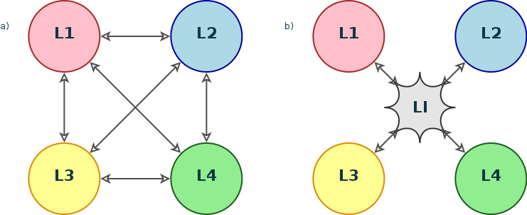

Introducción
============

.. warning:: Inicio demasiado directo, pero el momento en que tenga listo el
   estado del arte se puede empezar con el objetivo de la TFM y traer al lector
   hasta el campo de las traducciones.

El lenguaje universal (UNL, *Universal Networking Language*) es un lenguaje
eléctronico para las máquinas que permite representar oraciones como expresiones
lógicas sin ambigüedad; estas expresiones se generan para ser entendidas por
los ordenadores, no por las personas :cite:`Uchida1999`.

El UNL, como herramienta de representación del conocimiento, puede ser entendido
desde dos perspectivas diferentes: como una lengua que sirva de pivote en sistemas
de traducción automática o como un esquema de representación en sistemas de
recuperación de información :cite:`TeixeiraMartins2005`. De este modo este
lenguaje universal puede ser utilizado como la herramienta necesaria para romper
la barrera del idioma que separa a muchas personas del acceso al conocimiento que
no está expresado en un lenguaje que puedan entender.

Actualmente el inglés se ha erigido como la lengua vehicular en internet, para el
conocimiento científico, los negocios y la educación; quienes no son nativos
angloparlantes deben dedicar dinero y tiempo para acceder a estos conocimientos,
pero muchas otras personas no tendrán los recursos necesarios. Pero la barrera del
idioma también existe en el sentido contrario, el conocimiento expresado en otros
lenguajes como el español, chino, árabe, etc. resulta inaccesible para aquéllos
que no conocen estos idiomas.

La barrera del lenguaje
-----------------------

.. TODO: Incorporar en este párrafo:
   * Alguna referencia antropológica
   * Números sobre cuántos traductores hay
   * Cuántos debería haber para toda la información que se genera
   * Primeras herramientas informáticas de traducción automática.

A lo largo de los años se han tratado de adoptar diferentes soluciones para hacer
frente a este problema; en la época del colonialismo la metropolis imponía su idioma
en el gobierno de las colonias de tal forma que el acceso a los negocios, la
justicia, el poder o a las clases altas quedaba supeditado al conocimiento del lenguaje;
así se extendieron algunos idiomas europeos como el inglés, francés o español,
sustituyendo de forma permanente en algunos casos al idioma local. No obstante, el
lenguaje puede ser considerado la expresión de una cultura y constituye uno de los
símbolos de identidad más importantes para una población; no se puede pretender que
el conjunto de la humanidad converja hacia una única lengua común.

Durante el siglo XIX [#]_ se propusieron idiomas artificiales, construídos o planificados,
que fueran neutrales (no tuvieran su base en una lengua dominante) y sencillos (eliminando
muchas de las complicaciones del lenguaje natural). Surgieron propuestas más conocidas
como el esperanto y otras que obtuvieron menor atención como el ido, el
volapük o el *latino sine flexione* (interlingua de Peano). A pesar de que aún hoy
cuentan con algunos hablantes, la experiencia demuestra que no son la solución.

.. [#] Algunos idiomas artificiales datan de fechas tan tempranas como la *Lingua ignota*
   descrita en el siglo XII por Hildegarda de Bingen, abadesa de Rupertsberg :cite:`Lang2008`.

El último intento de lenguaje artificial, y quizá el que aún mantiene más interés [#]_ es
la interlingua de la *International Auxiliary Language Association* (IALA) que comenzó
su andadura después de la Primera Guerra Mundial y fue publicada por Alexander Gode
en 1951 :cite:`Gode1955`, esta lengua de aspecto naturalista está basada en vocablos
comunes a la mayoría de los idiomas del oeste de Europa y en una gramática anglorrománica
simplificada :cite:`WP-Interlingua`; de este modo pretende ser accesible a toda la comunidad
de hablantes de lenguas romances y derivadas.

.. [#] Existen versiones de Wikipedia (http://ia.wikipedia.org/) y de
   Google (http://www.google.com/intl/ia/) en interlingua.

Sistemas de traducción automática
---------------------------------
Con el surgimiento de la computación a mediados del siglo XX, la labor de traducción
intenta automatizarse a través de los ordenadores organizándose un área de investigación
con una proyección importante. La primera demostración de un sistema de traducción
automática tuvo lugar en enero de 1954 en Nueva York de la mano de IBM y la Universidad
de Georgetown [#]_. Se trataba de un sistema basado en la utilización de **diccionarios
y reglas**.

.. [#] IBM mantiene en Internet documentación sobre este evento y el ordenador
   IBM 701 en el que se ejecutó el programa: http://www-03.ibm.com/ibm/history/exhibits/701/701_intro.html (accedida el 21 de enero de 2015).

Como Hutchins :cite:`Hutchins1994` indica, la demostración tuvo un impacto
mediático muy importante y provocó la reacción de la Unión Soviética que priorizó el
desarrollo de este tipo de sistemas. En ambos países, sus respectivas agencias de
inteligencia instaron pusieron fondos al servicio de los investigadores, estábamos
en plena Guerra Fría.

El aparente éxito de este experimento hizo pensar que la traducción automática estaba
mucho más cerca de ser una realidad de lo que realmente estaba, esta euforia duraría
durante una década. En 1966 el *Automatic Language Processing Advisory Committee* (ALPAC)
liderado por John R. Pierce publica un informe :cite:`Pierce1966` donde refleja su
escepticismo sobre los resultados de los experimentos realizados durante esos años.
En el apartado de recomendaciones el comité indica dos líneas de trabajo, en primer lugar
sostiene que la lingüística computacional debe ser tratada como una ciencia y sus
resultados tienen que ser evaluados por personas competentes en la materia; y en
segundo lugar sugiere el desarrollo de varias líneas de trabajo [#]_, entre las
cuales nos interesa remarcar las siguientes:

 * Métodos prácticos para evaluar las traducciones.
 * Medios para acelerar el trabajo de los traductores.
 * Evaluación de la calidad y coste de varias fuentes de traducción.

.. [#] La lista original contiene los siguientes puntos: "1. practical methods
   for evaluation of translations; 2. means for speeding up the human translation
   process; 3. evaluation of quality and cost of various sources of translations;
   4. investigation of the utilization of translations, to guard against production
   of translations that are never read; 5. study of delays in the over-all
   translation process, and means for eliminating them, both in journals and in
   individual items; 6. evaluation of the relative speed and cost of various sorts
   of machine-aided translation; 7. adaptation of existing mechanized editing and
   production processes in translation; 8. the over-all translation process; and
   9. production of adequate reference works for the translator, including the
   adaptation of glossaries that now exist primarily for automatic dictionary look-up
   in machine translation".

Hutchins :cite:`Hutchins2003` realiza un breve resumen del informe y del impacto
que tuvo en la evolución de este área de investigación. En sus conclusiones señala
como un inconveniente que el informe se preocupaba únicamente de las necesidades
de traducción del mundo científico y administrativo, dejando a un lado los objetivos
del comercio y la industria en un mundo en globalización.

La confianza en los sistemas de traducción automáticos se recuperaría en la década de
los 1970s. Por un lado el éxito del sistema americano Logos MT (hoy OpenLogos) para
la traducción de manuales militares de inglés a vietnamita durante la Guerra de
Vietnam; y por otro la aparición de la compañía SYSTRAN que inicialmente también
trabajó en defensa, pero que pronto se orientaría también hacia usos comerciales.
Cabe destacar que hoy en día ambas compañías siguen en activo, ambas enfocadas en la
traducción bidireccional entre pares de lenguas :cite:`Scott2009` :cite:`Senellart2001`.

En los 1980s, con el incremento de la potencia de cálculo de los ordenadores, renace
el interés por los **modelos estadísticos** ya propuestos por Weaver
:cite:`Weaver1949` para traducción automática frente a los
sistemas basados en diccionarios y reglas que había sido posible crear hasta el
momento. Esta metodología de traducción sigue siendo hoy en día la más extendida.
Los modelos utilizados son aplicables a cualquier lengua, pero tiene algunos
dificultades inherentes relacionadas con la calidad de las traducciones o algunas
características propias de los idiomas que provoca que los resultados deban ser
revisados y, en consecuencia, su aceptación sea limitada.

El problema de la traducción automática se ha abordado también desde otras perspectivas:

 * traducción automática basada en diccionarios: las palabras son traducidas
   una a una según las entradas de un diccionario,
 * traducción automática mediante lengua intermedia: se trata de un tipo de traducción
   basada en reglas donde el texto original es convertido inicialmente a una
   interlingua desde la que se generan las traducciones a los idiomas de destino,
 * traducción automática mediante transferencia: es un caso de traducción basada en
   lengua intermedia donde se tiene en cuenta además las lenguas de origen y destino,
 * traducción automática basada en ejemplos (EBMT, *Example-based Machine Translation*):
   la traducción se realiza por analogía, utiliza un corpus alineado de textos, y
 * sistemas híbridos de traducción automática: utilizan una combinación de reglas y
   métodos estadísticos, tratando de explotar las mejores características de cada
   tipo :cite:`Costa-jussa2014`.

Traducción automática mediante lengua intermedia
------------------------------------------------
El conocido lingüista Noam Chomsky sostiene que el cerebro humano contiene un
conjunto limitado de reglas para organizaar el lenguaje y, por lo tanto, todos
los lenguajes tienen una base estructural común (Chomsky se refiere a ella como
la *gramática universal*). El hecho de que palabras e ideas puedan ser traducidos
de un idioma a otro, o la existencia de lenguas criollas aporta evidencias a esta
hipótesis :cite:`Kottak2002`. La utilización de una interlingua supone la
adhesión a esta corriente [#]_.

.. [#] La hipótesis contraria, conocida como Hipótesis de Sapir-Whorf, sostiene que
   las características del lenguaje condicionan la manera de pensar del hablante. Esta
   hipótesis toma el nombre de Edward Sapir, quien la formula originalmente, y de 
   Benajmin Lee Whorf, discípulo de aquél, que la desarrolla en la década de 1940.

Una de las principales ventajas de los sistemas que utilizan una lengua pivot frente a
los que se enfocan en la traducción entre pares de lenguas es el número de *traductores*
que se tienen que desarrollar para cubrir todas las necesidades (
:num:`figura #fig-interlingua`). En general son necesarias :math:`n(n-1)` para el caso directo
y :math:`2n` utilizando una interlingua; a partir de tres lenguas la aproximación con
interlingua requierirá menores esfuerzos de desarrollo.

   a) Grafo de traducciones necesarias en el caso de traducción directa
   (se necesitan 12 diccionarios de traducción); b) Grafo de traducciones necesarias
   utilizando una lengua puente (son necesarios únicamente 8 módulos de traducción).
   Fuente: Wikimedia Commons.

.. TODO: ¿Alguna referencia de cuántas lenguas pueden exister en el mundo globalizado
   actual para el entorno comercial

El mundo actual globalizado es un claro ejemplo de entorno multilingüe donde una
verdadera superación de la barrera del lenguaje sólo puede acometerse utilizando una
interlingua. La capacidad para localizar un producto en la lengua nativa de los clientes
permite el acceso a nuevos mercados.

.. TODO: Estimaciones de comercio sin barreras lingüísticas.

Sin embargo, a pesar de estos beneficios este tipo de traducción es una de las menos
utilizadas en la práctica, la mayoría son prototipos de investigación y sólo el
proyecto KANT [#]_ ha sido utilizado en un sistema comercial :cite:`Brown2006`, sin
embargo su aplicación se limita a la traducción de textos técnicos en inglés
controlado hacia francés, español y alemán :cite:`Lonsdale1994`.

.. [#] El proyecto Kant fue iniciado en 1989 por el Centro de Traducción Automática de
   la Universidad Carnegie Mellon (Pittsburg) para la traducción de documentación
   técnica. Más información puede ser consultada en su web:
   http://www.lti.cs.cmu.edu/Research/Kant/ (accedida 30 de marzo de 2015).

Alansary :cite:`AlAnsary2011` identifica cinco características que debe cumplir una
interlingua: no puede ser ambigua; debe ser capaz de representar todos los
matices del texto; tiene que ser universal para poder representar cualquier significado
de cualquier dominio; debe representar únicamente el contenido independientemente de
la representación formal del lenguaje de origen; y finalmente tiene que ser
independiente tanto del lenguaje de origen como del de destino. Teniendo en cuenta
estas características ningún lenguaje natural puede ser utilizado como interlingua
puesto que no estará exento de ambigüedad e, igualmente, ninguna interlingua puede
diseñarse con la idea de ser utilizada por las personas ya que con el tiempo
evolucionará apartándose de la ortodoxia.

.. TODO: Algo de Wittgenstein aquí lo petaba todo

En consecuencia, una lengua pivot para un sistema de traducción automática podrá
ser un lenguaje artificial como el lenguaje universal que introducíamos anteriormente.
Este constructo además de servir para realizar traducciones constituye una
herramienta de representación del conocimiento que puede ser utilizada en muchas
otras aplicaciones de recuperación de información.

.. warning:: Por aquí (y en el inicio de la introducción se introduce el UNL, en algún
   sitio habrá que hacer un repaso del mismo con algún ejemplo para contextualizar
   el tema de la TFM)

La calidad de la traducción
---------------------------
Uno de los apéndices del informe del ALPAC :cite:`Pierce1966` tuvo tanta
repercusión como el propio informe, se trata del apéndice 10 donde se describe
el experimento llevado a cabo por John B. Carroll para evaluar la calidad de las
traducciones, tanto humanas como automáticas. En su experimento se sometían
varias traducciones realizadas tanto por humanos como por máquinas a la evaluación
de un conjunto de personas que las valoraba según dos parámetros: inteligibilidad
y fidelidad.

El desarrollo de una medida que permmita evaluar la calidad de una traducción es
un asunto de extremada importancia, generalmente el destinatario de la traducción o
el que la solicita no es capaz de comprender uno de los dos idiomas, por lo que
debe fiarse de que el contenido que está entregando o recibiendo se corresponde con
el texto original.

En el experimento de Carroll la evaluación era realizada por personas que daban una
puntuación a distintos fragmentos de los textos traducidos comparados con los
originales. En las conclusiones se muestra claramente cómo los textos producidos por
los sistemas automáticos obtienen valores muy por debajo de los realizados por
traductores.

.. warning:: Aquí necesito meter un poco más de chicha (aunque esto ya va camino
   del estado del arte)

En este documento abordamos precisamente este problema: la definición de una medida
de distancia entre el texto original y la traducción que permita valorar el
rendimiento de un sistema de traducción automática. Como tendremos la ocasión de
exponer en el próximo capítulo, nuestra medida se apoyará en la interlingua para
poder realizar la comparación, tomará el grafo del texto original y medirá la
distancia al grafo resultante de convertir el texto traducído nuevamente a la
interlingua.

.. warning:: La conclusión de la introducción queda postpuesta a la definición del
   problema, modelo (y del estado del arte), una vez que veamos si tenemos
   que hablar de métricas de calidad de traducciones por aquí o esto lo
   hemos abordado en el estado del arte... pienso en artículos como :cite:`Rossi2013`.
